# arcs_cohort
A repository for tracking general tasks/issues, milestones, roadmap, etc. relevant to the overall CSUN ARCS CoHORT project.

## CoHORT Project Roadmap

The CoHORT project roadmap can be found [here](https://github.com/orgs/csun-arcs/projects/2).

## CoHORT System Architecture

```mermaid
flowchart LR
    %% ------------------------------------------------------------------------
    %% STYLE DEFINITIONS
    %% ------------------------------------------------------------------------
    classDef pkg fill:#ECECEC,stroke:#666,stroke-width:1px,color:#000,font-weight:bold
    classDef subpkg fill:#F2F2F2,stroke:#999,stroke-width:1px,color:#000
    classDef subsubpkg fill:#F2F2F2,stroke:#999,stroke-width:1px,color:#000
    classDef node fill:#FFF,stroke:#444,stroke-width:1px,color:#000
    classDef nobox fill:transparent,stroke:transparent,stroke-width:0px,color:#000,font-weight:bold

    %% ------------------------------------------------------------------------
    %% arcs_cohort_description
    %% ------------------------------------------------------------------------
    subgraph DESC[" "]
      direction TB
      desc_link["arcs_cohort_description"]:::nobox

      subgraph desc_sub[Robot Models]
        desc_urdf["URDF & XACROs"]:::node
        desc_sensors["Sensor Models"]:::node
      end
      class desc_sub subpkg

    end
    class DESC pkg
    click desc_link "https://github.com/csun-arcs/arcs_cohort_description" "arcs_cohort_description"

    %% ------------------------------------------------------------------------
    %% arcs_cohort_bringup
    %% ------------------------------------------------------------------------
    subgraph BRINGUP[" "]
      direction TB
      bringup_link["arcs_cohort_bringup"]:::nobox

      subgraph bringup_sub[Launchers + Configs]
      direction TB
        bringup_launchers["Main Launch Files"]:::node
        bringup_params["Param / YAML Config"]:::node
      end
      class bringup_sub subpkg

    end
    class BRINGUP pkg
    click bringup_link "https://github.com/csun-arcs/arcs_cohort_bringup" "arcs_cohort_bringup"

    %% ------------------------------------------------------------------------
    %% arcs_cohort_core
    %% ------------------------------------------------------------------------
    subgraph CORE[" "]
      direction TB
      core_link["arcs_cohort_core"]:::nobox

      subgraph core_sub[Motor Drivers + ROS 2 Control]
      direction TB
        dyn_hw["dynamixel_hardware<br/>(SystemInterface)"]:::node
        joint_ctrl["velocity_controller<br/> or diff_drive_controller"]:::node
        joint_state_broadcaster["joint_state_broadcaster"]:::node
      end
      class core_sub subpkg
      click dyn_hw "https://github.com/dynamixel-community/dynamixel_hardware" "dynamixel_hardware"

    end
    class CORE pkg
    click core_link "https://github.com/csun-arcs/arcs_cohort_core" "arcs_cohort_core"

    %% ------------------------------------------------------------------------
    %% arcs_cohort_control (optional advanced control logic)
    %% ------------------------------------------------------------------------
    subgraph CONTROL[arcs_cohort_control]
      vel_bridge["vel_cmd_bridge"]:::node
      custom_ctrl["(optional) custom logic"]:::node
    end
    class CONTROL pkg

    %% ------------------------------------------------------------------------
    %% arcs_cohort_sensing
    %% ------------------------------------------------------------------------
    subgraph SENSING[" "]
      direction TB
      sensing_link["arcs_cohort_sensing"]:::nobox

      subgraph sensing_sub["Sensor Drivers + Data Processing"]
        direction TB
  
        subgraph arcs_cohort_camera[" "]
          direction TB
          camera_link["arcs_cohort_camera"]:::nobox

          zed_node["zed_ros2_wrapper"]:::node
        end
        class arcs_cohort_camera subsubpkg
        click camera_link "https://github.com/csun-arcs/arcs_cohort_camera" "arcs_cohort_camera"
        click zed_node "https://github.com/stereolabs/zed-ros2-wrapper" "zed_ros2_wrapper"
  
        subgraph arcs_cohort_imu[" "]
          direction TB
          imu_link["arcs_cohort_imu"]:::nobox

          imu_node["vectornav"]:::node
        end
        class arcs_cohort_imu subsubpkg
        click imu_link "https://github.com/csun-arcs/arcs_cohort_imu" "arcs_cohort_imu"
        click imu_node "https://github.com/dawonn/vectornav" "vectornav"
  
        subgraph arcs_cohort_lidar[" "]
          direction TB
          lidar_link["arcs_cohort_lidar"]:::nobox

          lidar_node["velodyne"]:::node
        end
        class arcs_cohort_lidar subsubpkg
        click lidar_link "https://github.com/csun-arcs/arcs_cohort_lidar" "arcs_cohort_lidar"
        click lidar_node "https://github.com/ros-drivers/velodyne" "velodyne"

      end
      class sensing_sub subpkg
    end
    class SENSING pkg
    click sensing_link "https://github.com/csun-arcs/arcs_cohort_sensing" "arcs_cohort_sensing"

    %% ------------------------------------------------------------------------
    %% arcs_cohort_perception
    %% ------------------------------------------------------------------------
    subgraph PERCEPTION[" "]
      direction TB
      perception_link["arcs_cohort_perception"]:::nobox

      subgraph perception_sub["Mapping + Object Detection"]
        direction TB
        arcs_cohort_object_detector["arcs_cohort_object_detector"]:::node
        arcs_cohort_mapper["arcs_cohort_mapper"]:::node
      end
      class perception_sub subpkg
      click arcs_cohort_object_detector "https://github.com/csun-arcs/arcs_cohort_object_detector" "arcs_cohort_object_detector"
      click arcs_cohort_mapper "https://github.com/csun-arcs/arcs_cohort_object_detector" "arcs_cohort_mapper"

    end
    class PERCEPTION pkg
    click perception_link "https://github.com/csun-arcs/arcs_cohort_perception" "arcs_cohort_perception"

    %% ------------------------------------------------------------------------
    %% arcs_cohort_navigation
    %% Sub-subgraph for Nav2 + costmaps
    %% ------------------------------------------------------------------------
    subgraph NAV[" "]
      direction TB
      navigation_link["arcs_cohort_navigation"]:::nobox

      subgraph nav2_sub[Nav2 Stack]
      direction TB
        planner_srv["planner_server"]:::node
        controller_srv["controller_server"]:::node
        behavior_srv["behavior_server<br/>(BT Navigator)"]:::node
        global_costmap["global_costmap"]:::node
        local_costmap["local_costmap"]:::node
      end
      class nav2_sub subpkg

    end
    class NAV pkg
    click navigation_link "https://github.com/csun-arcs/arcs_cohort_navigation" "arcs_cohort_navigation"

    %% ------------------------------------------------------------------------
    %% arcs_cohort_fleet
    %% ------------------------------------------------------------------------
    subgraph FLEET[arcs_cohort_fleet]
      fleet_coordinator["fleet_coordinator"]:::node
      leader_election["leader_election_node"]:::node
    end
    class FLEET pkg

    %% ------------------------------------------------------------------------
    %% TOPICS (for one-to-many arrows)
    %% We'll represent major topics as dedicated nodes. We can link them.
    %% ------------------------------------------------------------------------
    odom_topic["/odom"]:::node
    click odom_topic "https://docs.ros.org/en/api/nav_msgs/html/msg/Odometry.html" "Odometry Topic"

    cmd_vel_topic["/cmd_vel"]:::node
    click cmd_vel_topic "http://docs.ros.org/en/api/geometry_msgs/html/msg/Twist.html" "Velocity Command Topic"

    zed_img_topic["/zedM/zed_node/images etc."]:::node
    click zed_img_topic "https://github.com/stereolabs/zed-ros2-wrapper" "ZED Image Topics"

    imu_topic["/vectornav/imu"]:::node
    click imu_topic "http://docs.ros.org/en/api/sensor_msgs/html/msg/Imu.html" "IMU Topic"

    lidar_topic["/velodyne_points"]:::node
    click lidar_topic "https://github.com/ros-drivers/velodyne" "Velodyne PointCloud Topic"

    perception_obstacles["/perception/obstacles or map"]:::node
    click perception_obstacles "#" "Custom messages"

    fleet_goals["/fleet/goals"]:::node
    click fleet_goals "#" "Fleet-level task commands"

    %% ------------------------------------------------------------------------
    %% EDGES / DATA FLOW
    %% ------------------------------------------------------------------------

    %% DESCRIPTION -> CORE
    desc_urdf -- references --> core_sub
    desc_sensors -- references --> core_sub
    bringup_launchers --launches--> core_sub
    bringup_launchers --launches--> arcs_cohort_camera
    bringup_launchers --launches--> arcs_cohort_imu
    bringup_launchers --launches--> arcs_cohort_lidar
    bringup_params --param_configures--> core_sub

    %% arcs_cohort_core producing /odom from diff drive
    joint_ctrl --> odom_topic
    dyn_hw --> joint_ctrl
    joint_state_broadcaster --> joint_ctrl

    %% arcs_cohort_navigation consumes /odom
    odom_topic --> planner_srv
    odom_topic --> controller_srv
    odom_topic --> behavior_srv
    odom_topic --> global_costmap
    odom_topic --> local_costmap

    %% arcs_cohort_navigation publishes /cmd_vel
    controller_srv --> cmd_vel_topic

    %% arcs_cohort_control bridging
    cmd_vel_topic --> vel_bridge
    vel_bridge --> dyn_hw
    custom_ctrl --> dyn_hw

    %% arcs_cohort_sensing -> arcs_cohort_perception
    arcs_cohort_camera --> zed_img_topic
    zed_img_topic --> arcs_cohort_object_detector
    zed_img_topic --> arcs_cohort_mapper

    arcs_cohort_imu --> imu_topic
    imu_topic --> arcs_cohort_mapper

    arcs_cohort_lidar --> lidar_topic
    lidar_topic --> arcs_cohort_mapper
    lidar_topic --> arcs_cohort_object_detector

    %% arcs_cohort_perception -> obstacles / map
    arcs_cohort_object_detector --> perception_obstacles
    arcs_cohort_mapper --> perception_obstacles

    %% arcs_cohort_navigation consumes /perception
    perception_obstacles --> global_costmap
    perception_obstacles --> local_costmap
    perception_obstacles --> planner_srv

    %% arcs_cohort_fleet
    fleet_coordinator --> fleet_goals
    leader_election --> fleet_coordinator
    fleet_goals --> behavior_srv

    %% Possibly behavior server interacts with planner / controller
    behavior_srv --> planner_srv
    behavior_srv --> controller_srv
```

