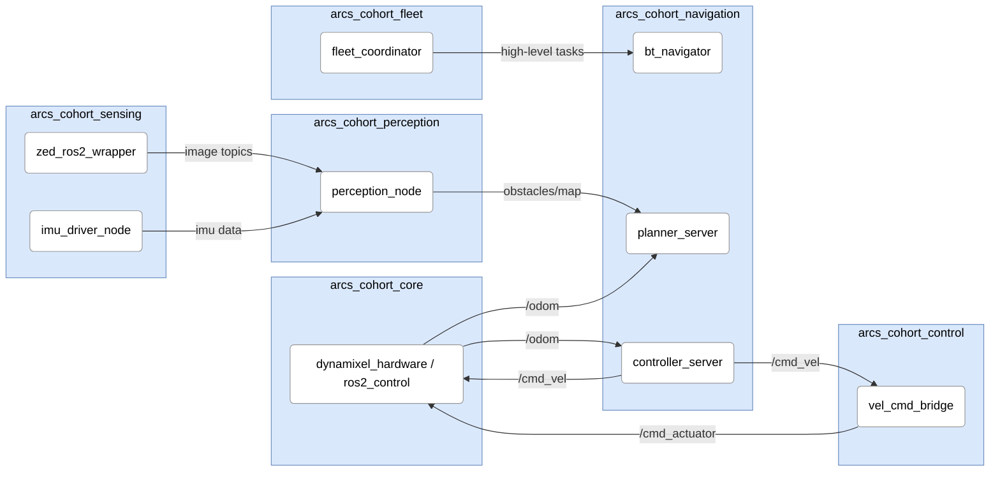

# arcs_cohort
A repository for tracking general tasks/issues, milestones, roadmap, etc. relevant to the overall CSUN ARCS CoHORT project.

## CoHORT System Architecture

```mermaid
flowchart LR
    %% Packages and nodes
    classDef pkg fill:#dae8fc,stroke:#6c8ebf,stroke-width:1px,color:#000
    classDef node fill:#ffffff,stroke:#999,color:#000,stroke-width:1px
    
    subgraph arcs_cohort_core[arcs_cohort_core]
      dynamixel_hardware("dynamixel_hardware / ros2_control"):::node
    end
    class arcs_cohort_core pkg
    
    subgraph arcs_cohort_sensing[arcs_cohort_sensing]
      zed_ros2_wrapper("zed_ros2_wrapper"):::node
      imu_driver_node("imu_driver_node"):::node
    end
    class arcs_cohort_sensing pkg
    
    subgraph arcs_cohort_perception[arcs_cohort_perception]
      perception_node("perception_node"):::node
    end
    class arcs_cohort_perception pkg
    
    subgraph arcs_cohort_navigation[arcs_cohort_navigation]
      planner_server("planner_server"):::node
      controller_server("controller_server"):::node
      bt_navigator("bt_navigator"):::node
    end
    class arcs_cohort_navigation pkg
    
    subgraph arcs_cohort_control[arcs_cohort_control]
      vel_cmd_bridge("vel_cmd_bridge"):::node
    end
    class arcs_cohort_control pkg
    
    subgraph arcs_cohort_fleet[arcs_cohort_fleet]
      fleet_coordinator("fleet_coordinator"):::node
    end
    class arcs_cohort_fleet pkg
    
    %% Diagram
    dynamixel_hardware -->|"/odom"| planner_server
    dynamixel_hardware -->|"/odom"| controller_server
    controller_server -->|"/cmd_vel"| dynamixel_hardware
    
    zed_ros2_wrapper -->|"image topics"| perception_node
    perception_node -->|"obstacles/map"| planner_server
    
    controller_server -->|"/cmd_vel"| vel_cmd_bridge
    vel_cmd_bridge -->|"/cmd_actuator"| dynamixel_hardware
    
    fleet_coordinator -->|"high-level tasks"| bt_navigator
    
    imu_driver_node -->|"imu data"| perception_node

    %% Links
    click dynamixel_hardware href "https://github.com/dynamixel-community/dynamixel_hardware"
    click zed_ros2_wrapper href "https://github.com/stereolabs/zed-ros2-wrapper"
```
