# CoHORT: Cooperative Human Operations with Robot Teams
A repository for tracking general tasks/issues, milestones, roadmap, etc. relevant to the overall CSUN ARCS CoHORT project.

## Project Roadmap

The CoHORT project roadmap can be found [here](https://github.com/orgs/csun-arcs/projects/2).

## System Architecture

```mermaid
flowchart LR
    %% ------------------------------------------------------------------------
    %% STYLE DEFINITIONS
    %% ------------------------------------------------------------------------
    classDef pkg fill:#ECECEC,stroke:#666,stroke-width:1px,color:#000,font-weight:bold
    classDef subpkg fill:#F2F2F2,stroke:#999,stroke-width:1px,color:#000
    classDef subsubpkg fill:#F2F2F2,stroke:#999,stroke-width:1px,color:#000
    classDef node fill:#FFF,stroke:#444,stroke-width:1px,color:#000
    classDef nobox fill:transparent,stroke:transparent,stroke-width:0px,color:#000,font-weight:bold

    %% ------------------------------------------------------------------------
    %% arcs_cohort_description
    %% ------------------------------------------------------------------------
    subgraph arcs_cohort_description[" "]
      direction TB
      desc_link["arcs_cohort_description"]:::nobox

      subgraph desc_sub[Robot Models]
        desc_urdf["URDF & XACROs"]:::node
        desc_sensors["Sensor Models"]:::node
      end
      class desc_sub subpkg

    end
    class arcs_cohort_description pkg
    click desc_link "https://github.com/csun-arcs/arcs_cohort_description" "arcs_cohort_description"

    %% ------------------------------------------------------------------------
    %% arcs_cohort_bringup
    %% ------------------------------------------------------------------------
    subgraph arcs_cohort_bringup[" "]
      direction TB
      bringup_link["arcs_cohort_bringup"]:::nobox

      subgraph bringup_sub[Launchers + Configs]
      direction TB
        bringup_launchers["Main Launch Files"]:::node
        bringup_params["Param / YAML Config"]:::node
      end
      class bringup_sub subpkg

    end
    class arcs_cohort_bringup pkg
    click bringup_link "https://github.com/csun-arcs/arcs_cohort_bringup" "arcs_cohort_bringup"

    %% ------------------------------------------------------------------------
    %% arcs_cohort_simulation
    %% ------------------------------------------------------------------------
    subgraph arcs_cohort_simulation[" "]
      direction TB
      sim_link["arcs_cohort_simulation"]:::nobox

      subgraph sim_sub[Gazebo + Isaac Sim]
        arcs_cohort_gazebo_sim["arcs_cohort_gazebo_sim"]:::node
        arcs_cohort_issac_sim["arcs_cohort_issac_sim"]:::node
      end
      class sim_sub subpkg

    end
    class arcs_cohort_simulation pkg
    click sim_link "https://github.com/csun-arcs/arcs_cohort_simulation" "arcs_cohort_simulation"
    click arcs_cohort_gazebo_sim "https://github.com/csun-arcs/arcs_cohort_gazebo_sim" "arcs_cohort_gazebo_sim"
    click arcs_cohort_issac_sim "https://github.com/csun-arcs/arcs_cohort_issac_sim" "arcs_cohort_issac_sim"

    %% ------------------------------------------------------------------------
    %% arcs_cohort_core
    %% ------------------------------------------------------------------------
    subgraph arcs_cohort_core[" "]
      direction TB
      core_link["arcs_cohort_core"]:::nobox

      subgraph core_sub[Motor Drivers + ROS 2 Control]
        direction TB
        dyn_hw["dynamixel_hardware<br/>(SystemInterface)"]:::node
        joint_ctrl["velocity_controller<br/> or diff_drive_controller"]:::node
        joint_state_broadcaster["joint_state_broadcaster"]:::node
      end
      class core_sub subpkg
      click dyn_hw "https://github.com/dynamixel-community/dynamixel_hardware" "dynamixel_hardware"
      click joint_state_broadcaster "https://control.ros.org/jazzy/doc/ros2_controllers/joint_state_broadcaster/doc/userdoc.html" "joint_state_broadcaster"
      click joint_ctrl "https://control.ros.org/jazzy/doc/ros2_controllers/velocity_controllers/doc/userdoc.html#velocity-controllers" "velocity_controller"

    end
    class arcs_cohort_core pkg
    click core_link "https://github.com/csun-arcs/arcs_cohort_core" "arcs_cohort_core"

    %% ------------------------------------------------------------------------
    %% arcs_cohort_control (optional advanced control logic)
    %% ------------------------------------------------------------------------
    subgraph arcs_cohort_control[" "]
      direction TB
      control_link["arcs_cohort_control"]:::nobox

      subgraph control_sub[PLACEHOLDER: Optional Advanced Control Stack]
        direction TB
        vel_bridge["vel_cmd_bridge"]:::node
        custom_ctrl["custom control logic"]:::node
      end
      class control_sub subpkg
    end
    class arcs_cohort_control pkg

    %% ------------------------------------------------------------------------
    %% arcs_cohort_sensing
    %% ------------------------------------------------------------------------
    subgraph arcs_cohort_sensing[" "]
      direction TB
      sensing_link["arcs_cohort_sensing"]:::nobox

      subgraph sensing_sub["Sensor Drivers + Data Processing"]
        direction TB
  
        subgraph arcs_cohort_camera[" "]
          direction TB
          camera_link["arcs_cohort_camera"]:::nobox

          zed_node["zed_ros2_wrapper"]:::node
        end
        class arcs_cohort_camera subsubpkg
        click camera_link "https://github.com/csun-arcs/arcs_cohort_camera" "arcs_cohort_camera"
        click zed_node "https://github.com/stereolabs/zed-ros2-wrapper" "zed_ros2_wrapper"
  
        subgraph arcs_cohort_imu[" "]
          direction TB
          imu_link["arcs_cohort_imu"]:::nobox

          imu_node["vectornav"]:::node
        end
        class arcs_cohort_imu subsubpkg
        click imu_link "https://github.com/csun-arcs/arcs_cohort_imu" "arcs_cohort_imu"
        click imu_node "https://github.com/dawonn/vectornav" "vectornav"
  
        subgraph arcs_cohort_lidar[" "]
          direction TB
          lidar_link["arcs_cohort_lidar"]:::nobox

          lidar_node["velodyne"]:::node
        end
        class arcs_cohort_lidar subsubpkg
        click lidar_link "https://github.com/csun-arcs/arcs_cohort_lidar" "arcs_cohort_lidar"
        click lidar_node "https://github.com/ros-drivers/velodyne" "velodyne"

      end
      class sensing_sub subpkg
    end
    class arcs_cohort_sensing pkg
    click sensing_link "https://github.com/csun-arcs/arcs_cohort_sensing" "arcs_cohort_sensing"

    %% ------------------------------------------------------------------------
    %% arcs_cohort_perception
    %% ------------------------------------------------------------------------
    subgraph arcs_cohort_perception[" "]
      direction TB
      perception_link["arcs_cohort_perception"]:::nobox

      subgraph perception_sub["Mapping + Object Detection"]
        direction TB
        arcs_cohort_object_detector["arcs_cohort_object_detector"]:::node
        arcs_cohort_mapper["arcs_cohort_mapper"]:::node
      end
      class perception_sub subpkg
      click arcs_cohort_object_detector "https://github.com/csun-arcs/arcs_cohort_object_detector" "arcs_cohort_object_detector"
      click arcs_cohort_mapper "https://github.com/csun-arcs/arcs_cohort_mapper" "arcs_cohort_mapper"

    end
    class arcs_cohort_perception pkg
    click perception_link "https://github.com/csun-arcs/arcs_cohort_perception" "arcs_cohort_perception"

    %% ------------------------------------------------------------------------
    %% arcs_cohort_navigation
    %% Sub-subgraph for Nav2 + costmaps
    %% ------------------------------------------------------------------------
    subgraph arcs_cohort_navigation[" "]
      direction TB
      navigation_link["arcs_cohort_navigation"]:::nobox

      subgraph nav2_sub[Nav2 Stack]
        direction TB
        planner_server["planner_server"]:::node
        controller_server["controller_server"]:::node
        behavior_server["behavior_server<br/>(BT Navigator)"]:::node
        global_costmap["global_costmap"]:::node
        local_costmap["local_costmap"]:::node
      end
      class nav2_sub subpkg
      click planner_server "https://docs.nav2.org/configuration/packages/configuring-planner-server.html" "planner_server"
      click controller_server "https://docs.nav2.org/configuration/packages/configuring-controller-server.html" "controller_server"
      click behavior_server "https://docs.nav2.org/configuration/packages/configuring-behavior-server.html" "behavior_server"
      click global_costmap "https://docs.nav2.org/configuration/packages/configuring-costmaps.html" "global_costmap"
      click local_costmap "https://docs.nav2.org/configuration/packages/configuring-costmaps.html" "local_costmap"

    end
    class arcs_cohort_navigation pkg
    click navigation_link "https://github.com/csun-arcs/arcs_cohort_navigation" "arcs_cohort_navigation"

    %% ------------------------------------------------------------------------
    %% arcs_cohort_fleet
    %% ------------------------------------------------------------------------
    subgraph arcs_cohort_fleet[" "]
      direction TB
      fleet_link["arcs_cohort_fleet"]:::nobox
      
      subgraph fleet_sub[PLACEHOLDER: Multi-Agent Autonomy Stack]
        fleet_coordinator["fleet_coordinator"]:::node
        leader_elector["leader_elector"]:::node
      end
      class fleet_sub subpkg
    end
    class arcs_cohort_fleet pkg

    %% ------------------------------------------------------------------------
    %% TOPICS (for one-to-many arrows)
    %% We'll represent major topics as dedicated nodes. We can link them.
    %% ------------------------------------------------------------------------
    odom_topic["/odom"]:::node
    click odom_topic "https://docs.ros.org/en/api/nav_msgs/html/msg/Odometry.html" "Odometry Topic"

    cmd_vel_topic["/cmd_vel"]:::node
    click cmd_vel_topic "http://docs.ros.org/en/api/geometry_msgs/html/msg/Twist.html" "Velocity Command Topic"

    zed_img_topic["/zedM/zed_node/images etc."]:::node
    click zed_img_topic "https://github.com/stereolabs/zed-ros2-wrapper" "ZED Image Topics"

    imu_topic["/vectornav/imu"]:::node
    click imu_topic "http://docs.ros.org/en/api/sensor_msgs/html/msg/Imu.html" "IMU Topic"

    lidar_topic["/velodyne_points"]:::node
    click lidar_topic "https://github.com/ros-drivers/velodyne" "Velodyne PointCloud Topic"

    perception_obstacles["/perception/obstacles or map"]:::node
    click perception_obstacles "#" "Custom messages"

    fleet_goals["/fleet/goals"]:::node
    click fleet_goals "#" "Fleet-level task commands"

    %% ------------------------------------------------------------------------
    %% EDGES / DATA FLOW
    %% ------------------------------------------------------------------------

    %% arcs_cohort_description -> arcs_cohort_core
    desc_urdf -- references --> core_sub
    desc_sensors -- references --> core_sub
    bringup_launchers --launches--> core_sub
    bringup_launchers --launches--> arcs_cohort_camera
    bringup_launchers --launches--> arcs_cohort_imu
    bringup_launchers --launches--> arcs_cohort_lidar
    bringup_launchers --launches--> arcs_cohort_gazebo_sim
    bringup_launchers --launches--> arcs_cohort_issac_sim
    bringup_params --param_configures--> core_sub

    %% arcs_cohort_simulation topic mappings
    arcs_cohort_gazebo_sim --> zed_img_topic
    arcs_cohort_gazebo_sim --> imu_topic
    arcs_cohort_gazebo_sim --> lidar_topic
    arcs_cohort_gazebo_sim --> odom_topic

    arcs_cohort_issac_sim --> zed_img_topic
    arcs_cohort_issac_sim --> imu_topic
    arcs_cohort_issac_sim --> lidar_topic
    arcs_cohort_issac_sim --> odom_topic

    %% arcs_cohort_core producing /odom from diff drive
    joint_ctrl --> odom_topic
    dyn_hw --> joint_ctrl
    joint_state_broadcaster --> joint_ctrl

    %% arcs_cohort_navigation consumes /odom
    odom_topic --> planner_server
    odom_topic --> controller_server
    odom_topic --> behavior_server
    odom_topic --> global_costmap
    odom_topic --> local_costmap

    %% arcs_cohort_navigation publishes /cmd_vel
    controller_server --> cmd_vel_topic

    %% arcs_cohort_control bridging
    cmd_vel_topic --> vel_bridge
    vel_bridge --> dyn_hw
    custom_ctrl --> dyn_hw

    %% arcs_cohort_sensing -> arcs_cohort_perception
    arcs_cohort_camera --> zed_img_topic
    zed_img_topic --> arcs_cohort_object_detector
    zed_img_topic --> arcs_cohort_mapper

    arcs_cohort_imu --> imu_topic
    imu_topic --> arcs_cohort_mapper

    arcs_cohort_lidar --> lidar_topic
    lidar_topic --> arcs_cohort_mapper
    lidar_topic --> arcs_cohort_object_detector

    %% arcs_cohort_perception -> obstacles / map
    arcs_cohort_object_detector --> perception_obstacles
    arcs_cohort_mapper --> perception_obstacles

    %% arcs_cohort_navigation consumes /perception
    perception_obstacles --> global_costmap
    perception_obstacles --> local_costmap
    perception_obstacles --> planner_server

    %% arcs_cohort_fleet
    fleet_coordinator --> fleet_goals
    leader_elector --> fleet_coordinator
    fleet_goals --> behavior_server

    %% Possibly behavior server interacts with planner / controller
    behavior_server --> planner_server
    behavior_server --> controller_server
```



## Repositories

- [arcscfg](https://github.com/csun-arcs/arcscfg): `arcscfg` is a command-line tool designed to streamline the management of ROS-based robotics projects at CSUN ARCS.
- [arcs_cohort_bringup](https://github.com/csun-arcs/arcs_cohort_bringup): A bringup package containing the main launchers for the ARCS CoHORT project.
- [arcs_cohort_description](https://github.com/csun-arcs/arcs_cohort_description): This package provides the description of the CSUN ARCS CoHORT rover, including its URDF model and sensor configurations, for use in ROS 2. It enables users to simulate and visualize the robot in RViz and Gazebo.
- [arcs_cohort_simulation](https://github.com/csun-arcs/arcs_cohort_simulation): A simulation meta-package that pulls in the following packages:
  - [arcs_cohort_rviz](https://github.com/csun-arcs/arcs_cohort_rviz): RViz configuration and launch files for the ARCS CoHORT project.
  - [arcs_cohort_gazebo_sim](https://github.com/csun-arcs/arcs_cohort_gazebo_sim): The `arcs_cohort_gazebo_sim` package provides a Gazebo simulation environment for the ARCS Cohort robot, enabling users to simulate the robot's behavior in various world configurations. It integrates with ROS 2 and Gazebo to support robot control, sensor simulation (e.g., Stereolabs Zed camera, LiDAR), and teleoperation using joysticks or keyboards.
- [arcs_cohort_perception](https://github.com/csun-arcs/arcs_cohort_perception): A perception meta-package that pulls in the following packages:
  - [arcs_cohort_sensor_preprocessor](https://github.com/csun-arcs/arcs_cohort_sensor_preprocessor): Sensor data preprocessing tools (e.g., pointcloud to laserscan).
- [arcs_cohort_navigation](https://github.com/csun-arcs/arcs_cohort_navigation): A navigation package based on [Nav 2](https://docs.nav2.org/).
- [arcs_cohort_docs_tools](https://github.com/csun-arcs/arcs_cohort_docs_tools): Contains tooling for auto-generation of wiki and README files for GitHub Actions workflows.

## Installation

### Quickstart

#### 1. Install [arcscfg](https://github.com/csun-arcs/arcscfg)

Follow the instructions on the [arcscfg](https://github.com/csun-arcs/arcscfg) repository page to install `arcscfg`.

#### 2. Install [ROS 2](https://docs.ros.org/en/rolling/index.html)

Install the appropriate [ROS 2](https://docs.ros.org/en/rolling/index.html) distribution for your system, e.g. [ROS 2 Jazzy Jalisco](https://docs.ros.org/en/jazzy/index.html) if you are on working on [Ubuntu 24.04.2 (Noble Numbat)](https://releases.ubuntu.com/noble/).

`arcscfg` can be used to automate the installation of ROS 2 if an appropriate installation script is available:

```bash
arcscfg install --install-ros2
```

#### 3. Install Dependencies

Install dependencies for your ROS 2 distribution using `arcscfg`:

```bash
arcscfg install --install-deps --ros-distro jazzy
```

You will be prompted to select a dependency configuration file.  Select the one that is most appropriate for your ROS 2 distribution / OS combo, e.g. `cohort_ros2_jazzy_ubuntu_noble.yaml` for Jazzy/Noble.  It is also possible to specify the appropriate dependency configuration file as a command-line argument:

```bash
arcscfg install --install-deps --ros-distro jazzy --dependency-file cohort_ros2_jazzy_ubuntu_noble.yaml
```

#### 4. Set up a CoHORT ROS 2 Workspace

Set up a CoHORT ROS 2 workspace using `arcscfg`:

```bash
arcscfg setup --workspace ~/cohort_ws --workspace-config cohort_jazzy.yaml
```

This will setup a workspace in the user's home directory at `~/cohort_ws` and clone the appropriate repositories as specified in `cohort_jazzy.yaml`.  This assumes that user wishes to clone the packages using the `SSH` Git transport/protocol for a developement environment, which requires the user to have their SSH key(s) set up on the Git host server.  To use the `HTTPS` Git transport/protocol instead, try:

```
arcscfg setup --workspace ~/cohort_tmp_ws --workspace-config cohort_jazzy.yaml --transport https
```

#### 5. Build the Workspace

The ROS 2 workspace may also be built using `arcscfg`:

```bash
arcscfg build --underlay /opt/ros/jazzy --workspace ~/cohort_ws
```

`arcscfg` uses [`colcon`](https://colcon.readthedocs.io/en/released/user/quick-start.html) under the hood, just like a standard ROS 2 workspace build.  To turn on symbolic link installation, use:

```bash
arcscfg build --underlay /opt/ros/jazzy --workspace ~/cohort_ws --symlink-install
```

## Usage

TODO
